# Learning OJS for Authors
This guide walks authors through the process of registering with a journal, making a submission, responding to peer review, uploading revisions, and proofreading the publication-ready version of a manuscript in OJS.
Other guides in this series include:
* [About OJS 3.5](../../about-ojs/en/) - Learn the basics about OJS, including how to register and manage your account. Recommended as the starting point for all users.
* [Learning OJS 3.5 for Site Administrators](../../site-admin/en/) - Learn how to manage an OJS installation and create new journals as a Site Administrator.
* [Learning OJS 3.5 for Journal Managers](../../journal-managers/en/) - Learn how to configure and prepare a journal to publish from start to finish as a Journal Manager. 
* [Learning OJS 3.5: The Editorial Workflow](../../editorial-workflow/en/) - Learn how to take a submission through review, copyediting, production, and publication. Recommended for Editors, Copyeditors, and Layout Designers.
* [Learning OJS 3.5 for Reviewers](../../reviewer/en/) - Learn how to respond to a review request and complete a review in OJS as a Reviewer.

## Register with the Journal {#register}
To make a submission to an OJS journal, you will first need to register a user account with a journal and log in (see [Create and Manage Your Account](../../about-ojs/en/#create-manage-account)). Your ability to make a submission will require that you have an author role associated with your account. You can generally choose this role when registering, but in rare cases an editor or journal manager will have to assign you author privileges.

After registering, you will be taken to the New Submission form.

## Start a Submission {#submit}
You can always make a new submission by clicking the **Start a New Submission** button on the left side menu. You will be taken to the submission wizard where you can upload and describe your submission.

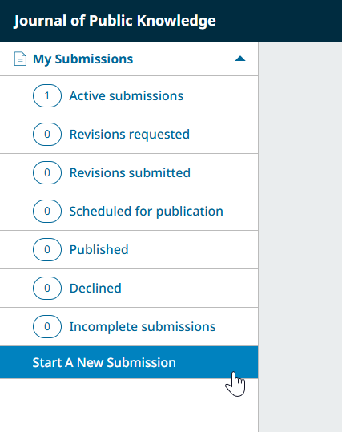

### Enter Preliminary Information {#preliminary-info}
First, you will provide preliminary information about your submission.

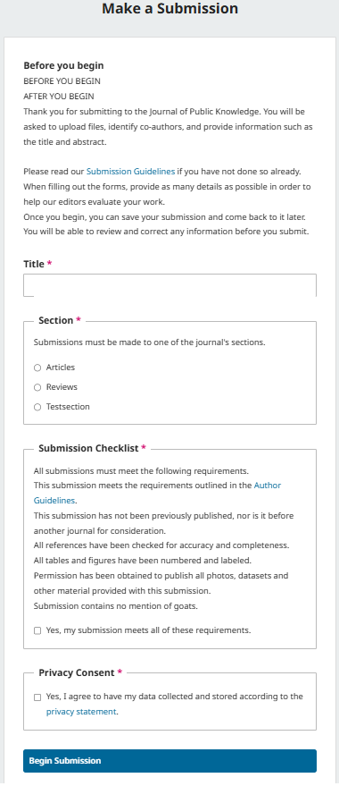

* **Language**: If the journal allows submissions in multiple languages, you will first need to select the appropriate language for your submission. 
* **Title**: Provide a title for your submission. You can access limited formatting options for the title by clicking on the formatting icon that appears when you enter text in the title field.
* **Section**: Select the appropriate section for your submission, if applicable (e.g., article, book review, etc.).
* **Submission Checklist**: Review the submission checklist and ensure that your submission meets the journal’s requirements. 

Lastly, review the privacy statement and agree to the journal’s data collection policy in order to begin your submission. 

Once you click the Start Submission button, you will be able to save your incomplete submission for later and return to it from your dashboard at any time.

### Step 1: Enter Submission Details
In step one, you will provide some basic information about your submission, including the language, abstract, and optionally, keywords and a list of references.

Formatting options for bold, italics, underline, superscript and subscript are available in the text editor when entering titles and subtitles. You can also use HTML tags for formatting these fields: 
* ``<b>`` (bold)
* ``<i>`` (italics)
* ``<u>`` (underline)
* ```` (superscript)
* ```` (subscript). 

To enter keywords, type the keyword or keyphrase and hit the Enter key. The word or phrase will be formatted as a keyword. There is no need to separate by commas or other punctuation.

If you have translated titles, abstracts or keywords to include, you can open additional fields for other languages by clicking the language in the upper right corner.

### Step 2: Upload Files {#upload}
In **Step 2**, a window will open allowing you to upload your submission file(s).

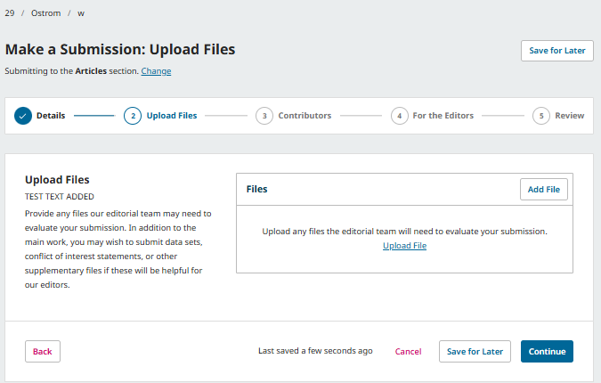

You can upload multiple files at once, as well as drag-and-drop files. 

Once you've uploaded all your files, you will be asked to choose a file type for each one. You can also add optional information such as a description or licensing information. You can edit these later if necessary.

Once you have finished uploading and indicating a type for all of your submission files, click the **Continue** button to move to the next step.

### Step 3: Add Contributors {#contributors}
In this step, you will be asked to add more information about contributors (i.e. authors and translators) involved in the submission. By default, your details will already be added as the primary contributor.

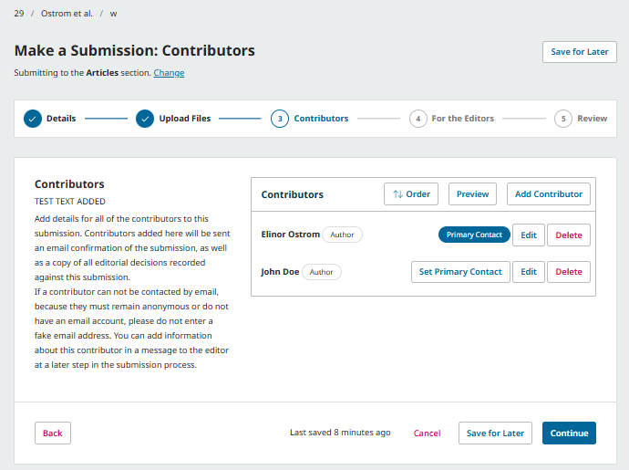

You can add additional contributors (e.g., co-authors), by clicking the **Add Contributors** button. This will open a new window with fields to enter their information.
> Contributors will receive an email confirmation of the submission. False email addresses should not be used for contributors. If there is no valid email contact for the contributor, it is recommended that you inform editors in the next step of the process as a note to the editor.
{:.notice}

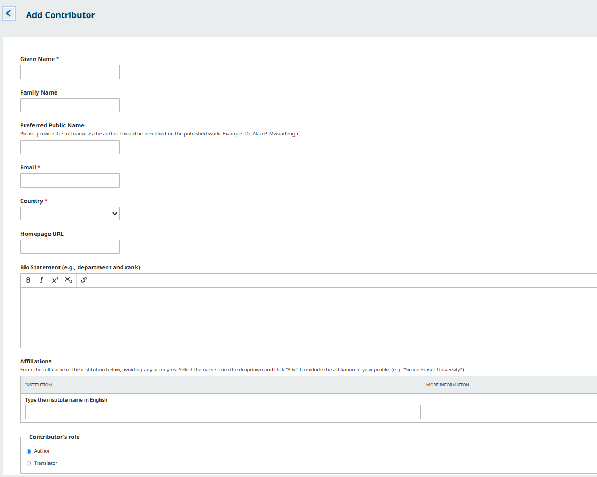

Hit **Save**, and the new contributor will be added to the list.

You can also change the order of the list of contributors. Click Order and press the up and down arrows beside a contributor to move them in the list. Click the Save Order button when you are done.

You can then preview the order in various forms, by using the “Preview Option” with options displayed for Abbreviated, Publication Lists, and Full order. 

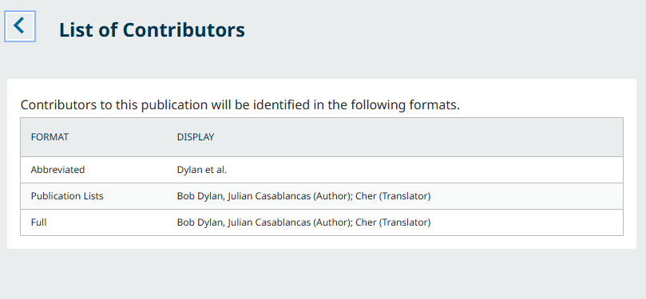

Once all contributors have been added and ordered to suit your preferences,  click **Continue** to proceed.

### Step 4: Enter Comments for Editors {#comments}
Next, you will be asked to provide any comments you have for the editors. This field is optional. Press Continue when you’re ready to move on.

### Step 5: Suggest Reviewers {#suggest-reviewers}

Depending on the journal’s settings, you may be asked to suggest reviewers. 

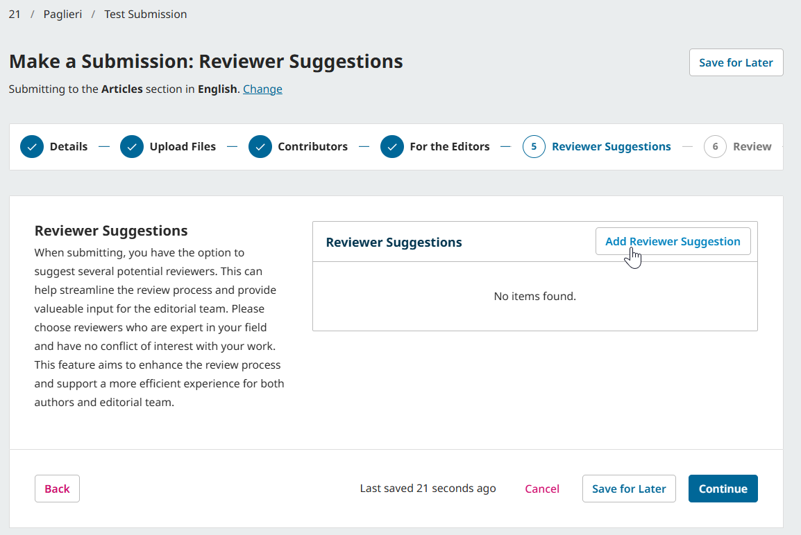

Read the journal’s instructions on the left side and click “Add Reviewer Suggestion” if you wish to suggest a reviewer. 

### Step 6: Review Your Submission {#review-submission}

Finally, you can review all of the information you’ve entered for your submission. If there are any required fields not filled out, you will be warned on this screen and given the opportunity to make corrections.

After reviewing the details of your submission, you will be asked to read and agree to the copyright terms for submissions to the journal. 

Click the checkbox to agree and click the **Submit** button.

A box will pop up asking you to confirm you are finished. Click **Submit** to finalize your submission.

### Complete Your Submission

Your submission is now complete! The editor has been notified of your submission. At this point, you can follow the links to:
* Review this submission
* Create a new submission
* Return to your dashboard

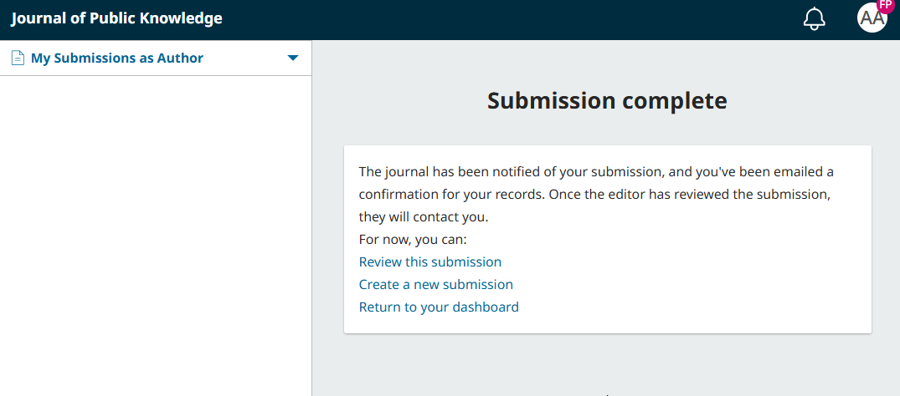

### Access and Track Your Submission

Once you’ve made your first Submission, you’ll have access to the My Submissions as Author Dashboard.

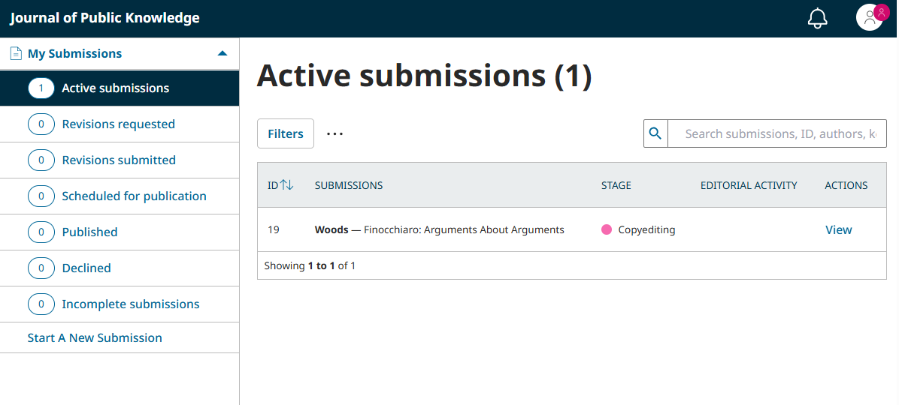

Once you complete a submission, you cannot make changes to it. If you wish to replace the file you submitted or make other changes to the submission, you will need to contact the editor through the Pre-Review Discussions tool.

Click “View” next to the submission on your dashboard to access the Discussions tool.

Immediately after submission, your submission will remain in the Submission stage until an editor accepts it for review, where it will move into the Review stage. If accepted for publication after review, it will later move into the Copyediting and Production stages before being published.

## Edit Submission Information {#edit}

Depending on the settings of the journal and its policies, you may be able to edit your manuscript details during the submission process. This includes editions to the title, contributors, keywords, etc. (referred to as “metadata” in the software). Changes might include updated abstracts, correcting spelling errors, or adding additional contributors.

To edit your submitted manuscript, click on the Publication tab of your submission.

> If the ‘Save’ button at the bottom of the page is grey and inactive, this means you will have to request permission from the Editor to make changes to your submission or ask them to make the changes for you.
{:.notice}

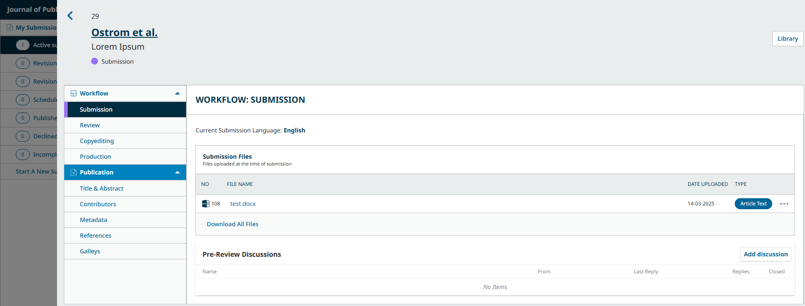

Make changes to any of the information about your submission by clicking the related tab in the sidebar. If you have editing permissions, you will be able to make changes to the following sections on the Publication tab: Title & Abstract, Contributors, and Metadata.

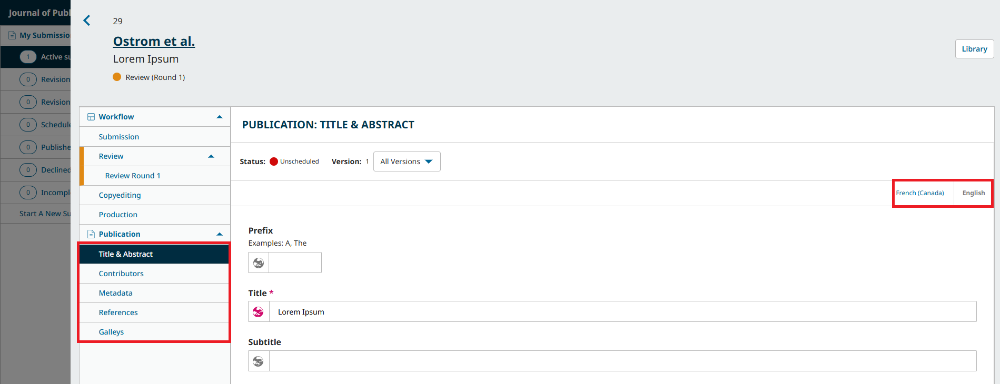

If multiple languages are enabled for the journal, you will be able to edit metadata in those languages by clicking on the relevant language tab in the top right. Click ‘Save’ once you’re done making your changes.

To learn more about creating quality metadata for your submissions, see [the Better Practices in Journal Metadata guide](/metadata-practices/en/).

## Respond to Requests for Revision or Resubmit for Review {#respond-review}

Once the review process has been completed, you will be notified of the editor’s decision via email.

After receiving the email with the decision, click the provided link or login and access the manuscript from the dashboard.

In the Review tab of the manuscript, you will also see a copy of the Editorial Decision under Notifications. 

> Depending on the type of peer review used by the journal, you may see less information on the Review tab of the journal. (The image below shows an open peer review wherein authors can see the identity of the reviewer.) 
{:.notice}

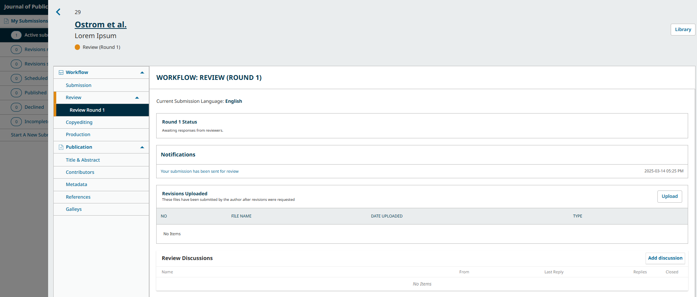

To view the Editorial decision, click the link under notifications.

Based on the Editor’s decision, you must now prepare your revisions.

### Upload the Revised File

Once you’re ready to upload the revised file, scroll down to find the **Revisions Uploaded** panel.

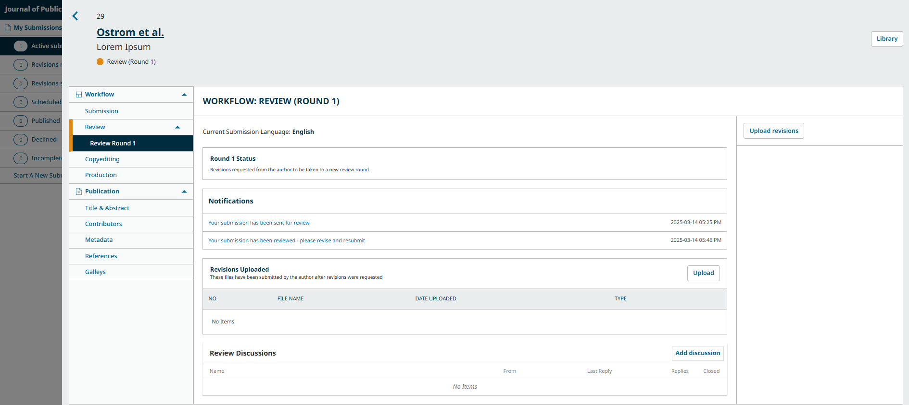

Click in *Upload a File* to upload your revised manuscript.

Use the dropdown menu to indicate that you’re uploading a revision of an existing file.
Then upload the revised file and hit **Continue**.

Check the file details and hit **Continue** again.

If you have any additional files to upload, do so now. Otherwise, hit **Complete**. The editor will receive a notification about the new file(s) being uploaded

Your revised file is now visible in the Revisions panel.

You can provide additional details or directly inform the editor about the revisions through the Review Discussion panel.

Click in *Add Discussion* from the Review Discussions panel.

Select the user(s) you want to notify under Participants.

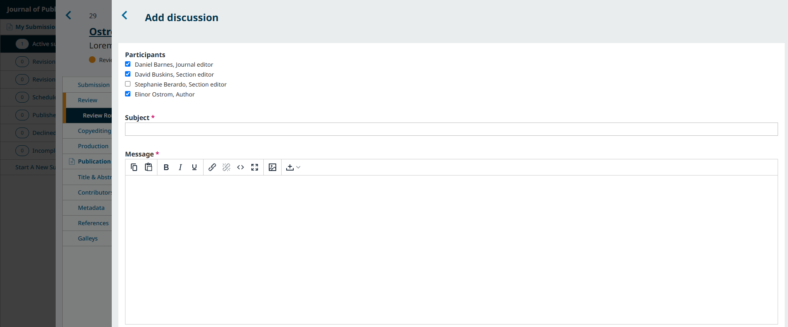

Add a subject line and a message.

Hit **OK** to send the message.

An email has now been sent to the editor. You and the selected participants can see the message in the Review Discussions panel.

If the editor’s decision was to resubmit for review, your revisions will be subject to another round of review before the decision to accept or decline is made. You may need to make further revisions by repeating the above procedure after the additional round of review.

At this stage, you must wait for the editor to contact you with further instructions or their final decision.

### Revisions Accepted

In the event that the revisions you’ve made to your submitted manuscript are accepted, you will receive an email notification as well as a  notification on your dashboard.

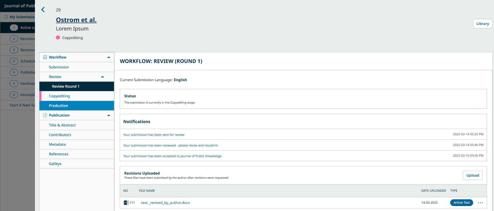

The notifications show up in order from oldest to most recent, meaning the most recent one will be on the bottom. Click on it to open the message (which is the same as the email you would have also received).

Use the **X** in the upper right corner to close the window.

Further down your dashboard, you will also see a discussion reply from the editor.

Click in the discussion title to open it up.

Congratulations! Your manuscript has been accepted and your submission file will be copyedited and prepared for publication by the journal’s editorial board.

## Respond to a Copyediting or Proofreading Request {#respond-copyediting-proofreading}

Throughout the copyediting and production stages, you may be asked to inspect copyedited files and/or to review publication-ready copies of your submitted manuscript. 

You will be notified by email and through a notification on your OJS dashboard whenever there is a copyedited file or publication-ready file for you to review.

To access the files that require your revision, click the link in the email or notification, or go to your dashboard and click “View” next to the submission.

From here, you can view both the discussions and the files for the current stage of the editorial workflow. Any files requiring your review will be shared below the discussions panel.

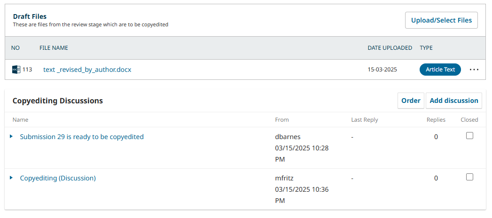

Once you have downloaded and reviewed the attached files, click on the title of the discussion to open the message.

Click “Add message” and indicate any required changes or give your approval. If needed, you can also attach a revision.

After reviewing and approving the copyedited files and final galleys (e.g., PDFs, HTML, etc.) before publication as requested, your role in the editorial workflow is now completed!
