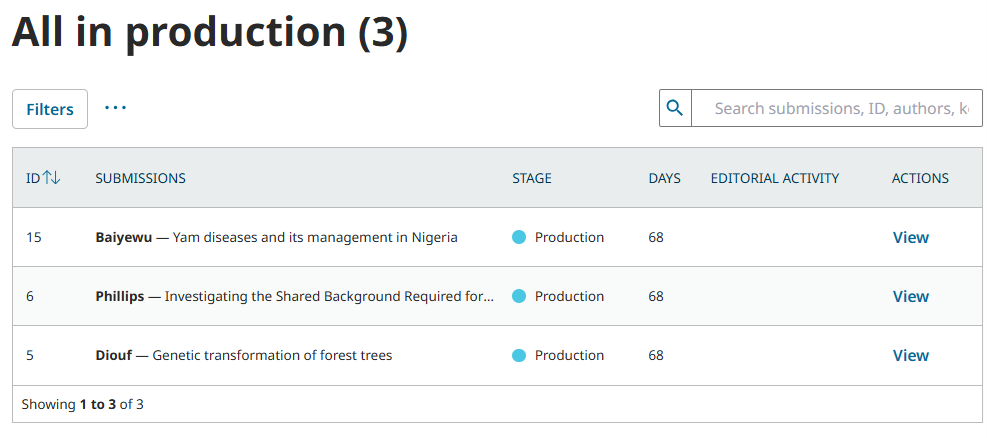
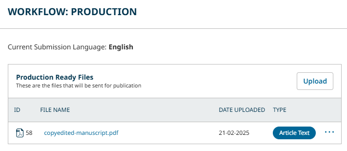
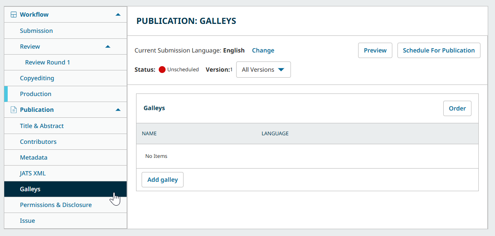
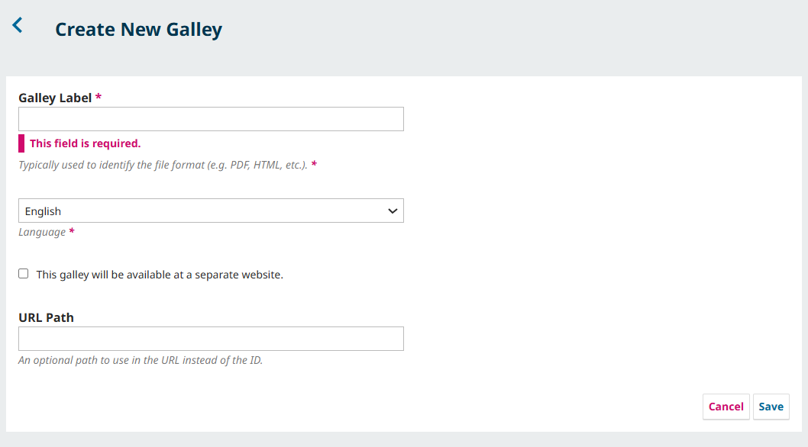
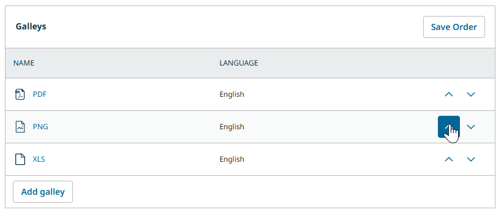
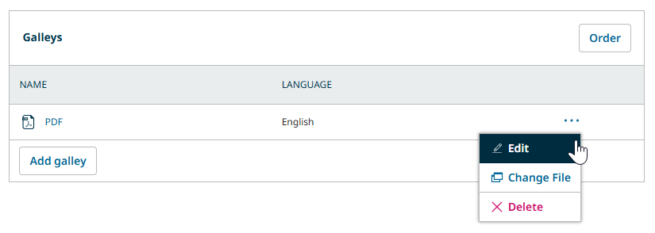

# Production: Prepare Final File Formats and Finalize Details {#production}
The final stage of the Editorial Workflow is the Production stage. After passing peer review and being copyedited, it’s time to prepare the files for publication.

In this chapter, we will explain:
* What galley files are and how to upload them
* How to edit the metadata of an article (key information such as title, abstract, author information, etc.)

The roles involved in this stage are typically Editors, Layout Editors/Designers, and Authors (for approval of the final galleys).

> Editors can cancel production and return the submission to the Copyediting stage at any time by clicking “Back to Copyediting” in the action buttons
{:.tip}

> These instructions assume you are using a traditional issue-based publishing model. If you are interested in adopting a Continuous/Early View publishing model, please consult our Continuous Publishing guide (forthcoming).
{:.warning}

## Track Submissions in Production {#track}

You can view which submissions are in Production from the “All in production” Dashboard view. Additionally, all submissions in copyediting will have the blue production stage indicator.

Dedicated layout editors, designers, and other assignees will also be able to access their assignments from the “Assigned to me” and “All in production” Dashboard views.

## Format Final Proofs for Publication

You will need to prepare the final formats of the article for readers to access. In publishing, these final proofs are typically referred to as “galley” files.

Galleys are generally in a *stable, non-editable* format (e.g., HTML, PDF, ePub, or XML). Galley files can also include supplementary material such as multimedia files and research data. 

An example of galley files a journal might provide for an article about an art piece might be: a PDF version of the article text, a ZIP file containing raw analysis data, and a high quality image file of the art.

### Assign a Layout Editor

If your journal has dedicated layout editors or designers to prepare the final version of the article, you can assign them as a participant just as you would [assign a copyeditor in the Copyediting stage](./copyediting#assign). 

### Prepare Files for Production

Whether the final formats will be created by a dedicated layout editor or the editor in charge of the submission, the next step is to download the files that need to be formatted.

The Production Ready Files section contains the copyedited files selected for production by the Editor after copyediting was completed. Click on the filename to download the file and begin copyediting with your program of choice.

### What Galleys Formats Can OJS Accept?

OJS allows users to upload almost any kind of file so long as it fits the limitations set by the system administrator, but some common galley types include:

* PDF - The most common file type for galleys in OJS.
* HTML - Another common type. These can also be used as containers for multimedia presentations.
* ePub
* XML
* MP3
* Image formats (PNG, JPG, GIF)
* External links - OJS can also link to galleys hosted off-site, for example, videos uploaded to video hosting services.

PKP is currently working to prepare guidance on creating these types of files and maximizing the software’s ability to support multimodal/multimedia publishing. In the meantime, the [Prepare and Add Galley Files section of Learning OJS 3.4](https://docs.pkp.sfu.ca/learning-ojs/en/production-publication#prepare-and-add-galley-files) may be helpful for those looking for detailed information about these formats.

### Add Galley Files

Once you have prepared the galley files in as many formats as you wish to offer, navigate to the Galleys item under the Publication menu.

Click the “Add galley” button to open the Create New Galley window.

First, you’ll be asked to enter a Galley Label. This text will appear on the button to open or download the galley. Most journals will enter the file format in this field.

Next, use the dropdown to specify the language of the galley.

If you wish to link to content outside of OJS, click the checkbox next to “This galley will be available at a separate website.” and enter the URL for the content in the field that appears.

Lastly, you can optionally specify a unique URL path for the galley.

> Generally, object IDs are used in the URL of a galley, for example: workshop.publicknowledgeproject.org/index.php/plan-s/article/view/239/**157**
>
> In this example **157** is the object ID. We could enter “pdf” in the URL path, which would result in the following URL for our galley: 
workshop.publicknowledgeproject.org/index.php/plan-s/article/view/239/**pdf**

Click Save to move to the file upload window.

To upload the file:
1. Identify the file you are uploading. If you are uploading a manuscript or a data set, choose the corresponding type.
2. Drag and drop the file you wish to upload, or press Upload File to use the File Browser. Click Continue.
3. Rename the file and fill out the optional information fields as necessary. The file name will be visible to readers if they choose to download the file. Click continue.
4. Press the Complete button after your file has been successfully uploaded.

> You may wish to use Discussions to communicate with Authors and Editors and get their approval for the final galleys. 
{:.tip}

### Change the Order of Galleys

If you have multiple galley files, you may wish to display them in a specific order. Click the Order button in the Galleys panel to begin ordering,

Use the arrow icons to move galleys up and down the list. When you are done, click the Save Order button.
### Edit, Replace, or Delete Galley Files

> If an article has **already been published** AND the new galley includes **substantial changes** (i.e. changes with an impact on the content, meaning, or findings of the article), we strongly recommend creating a new version of the article. See [Version a Published Article](./publication.md#versioning).
{:.warning}

To edit, replace, or delete a galley file, click the three dots beside the galley file.

Choose the relevant option to make any necessary updates to your galley files.

> Note: If an article has already been published, it will need to be unpublished before you can edit, replace, or delete a galley. Click Unpublish at the top right of the window, make your changes, and click Schedule for Publication to publish it once again.
{:.warning}

### Preview Galleys 

You may wish to preview the galley labels and galley display. Click the Preview button on the top right of the Galleys window.

This will show you the article landing page exactly as it will appear to readers. Click a galley label to open the file.

## Use the Publication Menu to Finalize Details

Once you or your layout editor has finalized the galleys for the submission, the final step is to edit the metadata of the submission. Metadata is information about the submission. This includes basic information like the author list, abstract, title, copyright information, and more.

While much of this information will have been provided to you by the author, it is the job of the Editor to make sure that this metadata is accurate. Accurate and complete metadata is a key element for allowing your journal’s content to be indexed and easily discovered.

You can make these changes using the Publication menu on the left side of a submission record.

> Note: If an article has already been published, it will need to be unpublished before you can edit these details. Click Unpublish at the top right of the window, make your changes, and click Schedule for Publication to publish it once again.
{:.warning}

We will explore each item in the menu below.

* **Title & Abstract**: Edit the article title, subtitle, and abstract.
* **Contributors**: Add, edit, or remove article contributors.
* **Metadata**: Add or edit additional metadata requested by the journal such as keywords.This item will only appear for journals who have enabled the collection of additional metadata in [their metadata settings](../../journal-managers/en/policies.md#metadata-settings).
* **References**: Add or edit the reference list for the submission. Note that every reference should be entered on a new line. This item will only appear for journals who have enabled the collection of references in [their metadata settings](../../journal-managers/en/policies.md#metadata-settings).
* **JATS XML**: View, download, or upload a JATS XML record for the submission. (Unfamiliar with JATS XML? Learn more from [this interview on the PKP Blog](https://pkp.sfu.ca/2024/04/30/jats-xml-scholarly-publishing-interview-alec-smecher/).
**Galleys**: Upload the final files for publication, as explained above.
**Permissions & Disclosure**: Edit copyright holder, copyright year, and license. These are generally filled in automatically according to the journal’s settings. Use this tab to override these defaults.
**Issues**: Assign the article to a journal issue. This will be explained in the [Publication & Postpublication chapter of this guide](./publication.md).

>Note: If your journal is using identifiers such as DOIs or plugins related to identifiers (e.g. the Crossref Reference Linking plugin), you should consult the DOIs and DOI Plugin guide](https://docs.pkp.sfu.ca/doi-plugin/en/) and the related [Crossref Plugin Guide](https://docs.pkp.sfu.ca/crossref-ojs-manual/en/references) (if using Crossref services).
{:.notice}

Edit the information on this tab in any relevant languages and be sure to click Save at the bottom of each page.

Now the submission should have everything needed for you to formally publish the content online.
