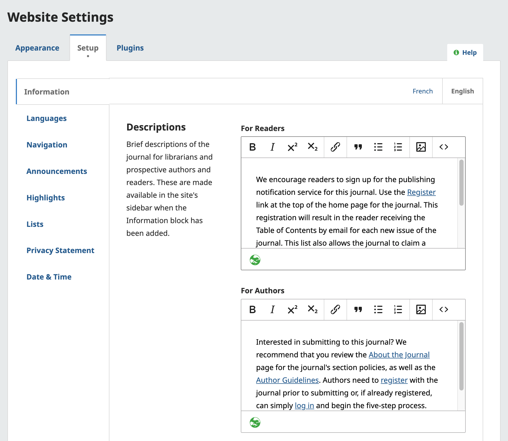
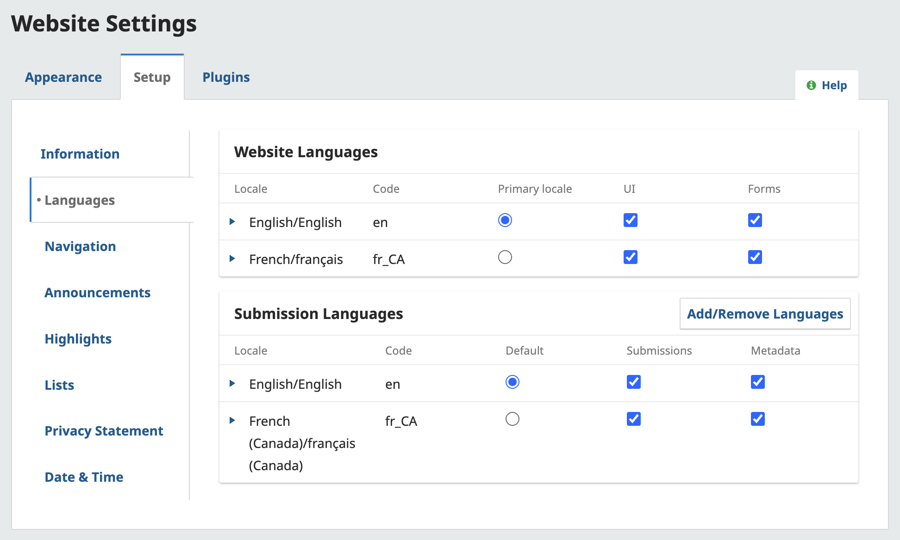
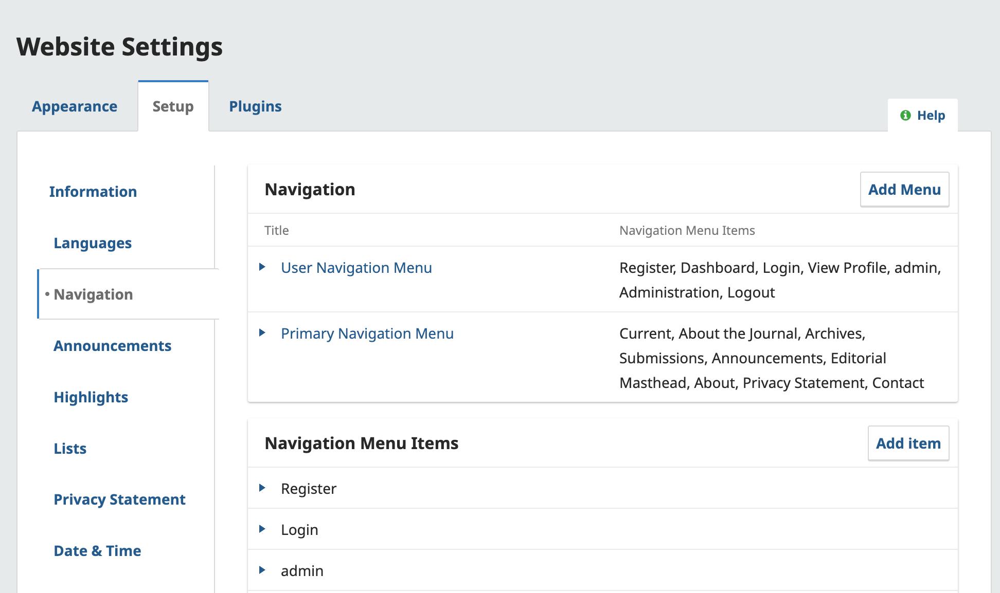
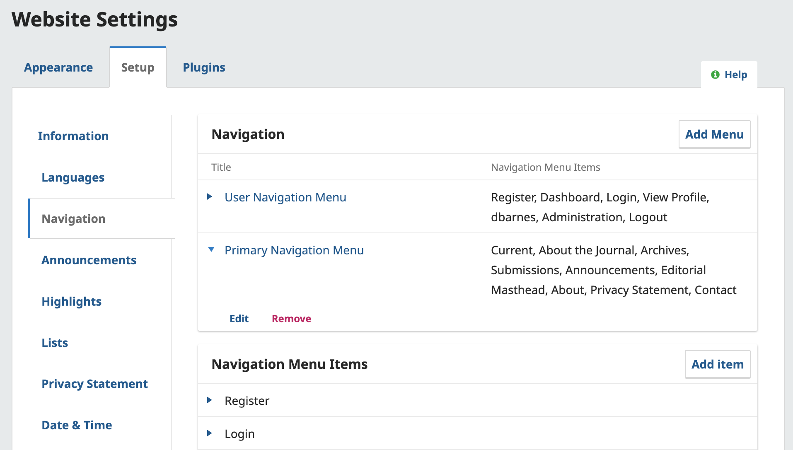
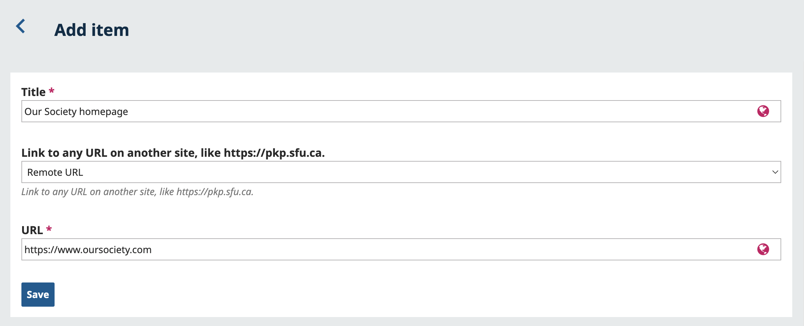
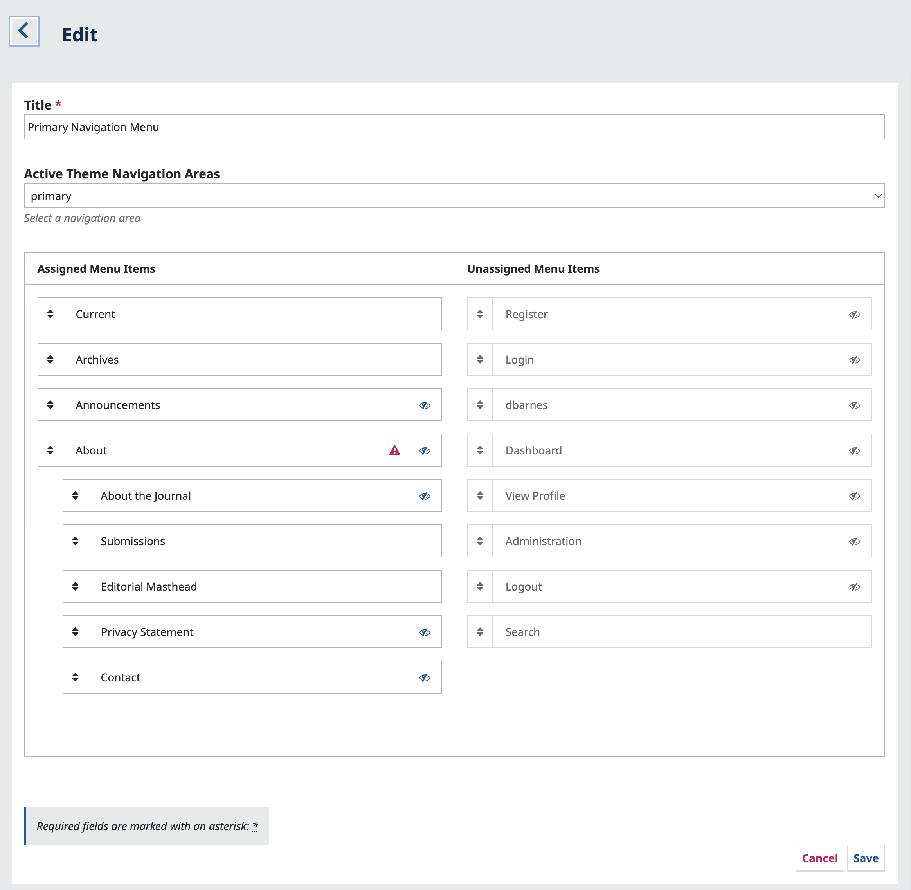
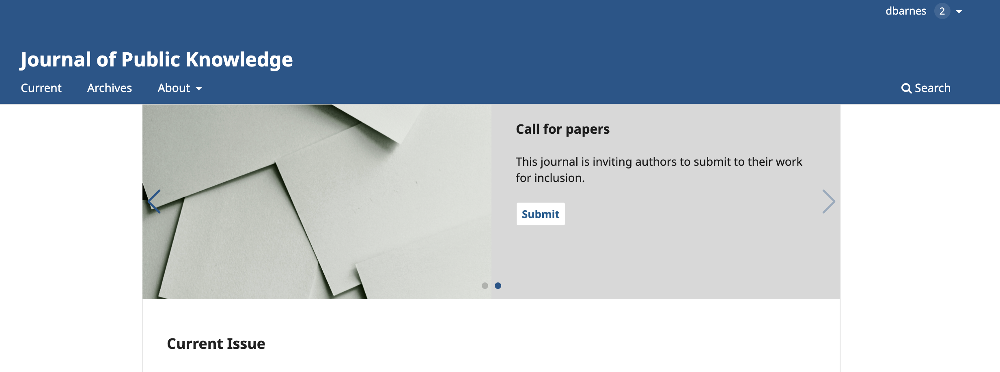

# Customize the Look of Your Journal
OJS allows you to customize the look and feel of your journal by applying your logos and branding to a variety of themes. 

This section will walk you through the basic settings, but if you are looking for an in-depth guide about branding and designing your journal, including previews of the available themes, we recommend reading our [Designing Your Journal guide](https://docs.pkp.sfu.ca/designing-your-journal/en/).

This PKP School video explains how to configure your journal's appearance in OJS. To watch other videos in this series, visit [PKP’s YouTube channel](https://www.youtube.com/playlist?list=PLg358gdRUrDVTXpuGXiMgETgnIouWoWaY).



## Choose and Customize a Theme {#appearance}

To choose a theme and customize various theme elements, access Website settings from the sidebar on the left. You’ll be brought to the Appearance tab, where you can adjust details related to your site’s dsign.

The first section of the Appearance tab is the Theme section. The theme determines the overall design or layout of your site. You can change your theme at any time without affecting your site's content or configurations. 

You can choose any installed and enabled themes from the dropdown menu.  Once you choose a theme and click **Save**, you may be presented with further customization options, such as font and color selection, image placement options, and more.

To learn more about these customization options, what themes are available and how to install them, please see our [Designing Your Journal guide](https://docs.pkp.sfu.ca/designing-your-journal/en/).

> As of OJS/OMP/OPS 3.3, the **Default Theme** has been externally audited for accessibility and adheres to best practices like colour contrast, keyboard navigation, and form/link focus. Read the [PKP Accessibility Statement](https://docs.pkp.sfu.ca/accessibility-statement/) for more details. Note that any changes made to the theme may impact accessibility.
{:.notice}

### Upload Logos and Customize Your Sidebar {#logo-sidebar}

In the Setup section of the Appearance tab, you can upload image elements (logo, thumbnail, homepage) to your site's main page, enter footer information, and configure your sidebar menu.

- **Journal thumbnail**: Upload a small logo or image representative of the journal that will be used in lists of journals on this OJS installation. This will only be used on OJS installations with multiple journals.

- **Homepage Image**: Upload an image here to place it on your journal's home page.

- **Page Footer**: Enter any images, text or HTML code that you'd like to appear at the bottom of your website.

- **Sidebar**: This allows you to move different elements (“blocks”) in or out of the sidebar in the reader interface. This includes custom blocks created using the Custom Block plugin.

### Use Advanced Options for Further Customizations {#advanced}

In the Advanced section of the Appearance tab, you can upload your journal stylesheet, Favicon, and Additional Content.

- **Journal Style Sheet**: Use this to upload a style sheet for your journal. Instructions on modifying the CSS are available in the [Designing Your Journal: Creating a Stylesheet](https://docs.pkp.sfu.ca/designing-your-journal/en/creating-stylesheet) guide.

- **Journal Favicon**: Add a [favicon](https://en.wikipedia.org/wiki/Favicon) to display in the reader's browser address bar.

- **Additional Content**: Any text entered here will appear on your homepage, allowing you to add any important information or links relevant to your journal.

Hit **Save** to record your changes.

## Configure Additional Display Options for Your Site {#display-options}

In the Setup tab of the Website, you can configure additional display options. This includes language settings, date/time display, navigation menus and custom site pages, list length, and your site’s privacy statement.

Each option in this tab is described in detail below.

### Customize Information Block {#information}

In the Information section of Website > Setup, you can modify the text in the For Readers, For Authors, For Librarians pages on the journal website. These can be useful for first-time users.

> To **remove** these fields and their contents from displaying publicly on the website's user interface, deselect the Information Block in Website Settings > Appearance > Sidebar Management.
{:.tip}

### Set Languages for Submissions and Interface {#languages}
.
OJS is multilingual, which means that the interface, emails, and published content can be available in multiple languages. Additionally, you can allow authors to make submissions in one or more languages.

This PKP School video explains how to configure the Language settings in OJS. To watch other videos in this series, visit [PKP’s YouTube channel](https://www.youtube.com/playlist?list=PLg358gdRUrDVTXpuGXiMgETgnIouWoWaY).

.

Under Website Settings > Setup > Languages, you will see the list of languages or locales installed on your site and their configuration options. You can learn about the specific options as well as warnings and considerations in our detailed [Multilingualism Guide](https://docs.pkp.sfu.ca/multiling-guide/en/locales).

> If you’re offering the UI in multiple languages, make sure that the Language Toggle Block is active under Website Settings > Appearance > Sidebar Management so users can switch between languages.
{:.tip}

### Customize Navigation and Add New Pages {#navigation}

The Navigation section of Website > Setup allows you to configure your site’s navigation menus, including adding new links and pages.

This PKP School video explains how to configure the Navigation settings in OJS. To watch other videos in this series, visit [PKP’s YouTube channel](https://www.youtube.com/playlist?list=PLg358gdRUrDVTXpuGXiMgETgnIouWoWaY).



#### Edit and Organize Your Navigation Menus {#nav-order}

In the Navigation area, you can edit the User Menu (the menu shown when a user hovers over their username or the Register link) or the Primary Navigation Menu (the navigation menu used to access the different pages of your journal site). 

Click the blue arrow button to reveal the Edit link. In the edit window, you can drag and drop the menu items to remove, add, and reorganize them, as well as arrange them into submenus.

>Some menu item types will only be displayed to users under certain conditions. Menu items with display conditions are marked by an icon of an eye with a slash through it. Click the icon to learn more about when it will be displayed or hidden.
{:.tip}

#### Add Links and New Pages to Your Site’s Menu {#links-pages}

In Navigation Menu Items, you will find predefined links you can add to either menu above. If you wish to add a link or a new page to a menu, add it here using the _Add Item_ link.

You’ll be able to choose between an existing OJS page, an external URL, or a custom page from the dropdown. 

When creating a custom page or linking to an external link, you’ll need to add a title (the text that will display in the menu). Custom pages will also require a path (use a single word or multiple words separate by hyphens) as well as the content you’d like to appear on the page. 

Hit Save to record your changes, and your new item will appear in the list of Navigation Menu Items. They can now be added to the menu of your choice.

### Create a Journal Highlight {#highlights}
> Note: The Highlights feature may not currently work with all themes.
{:.warning}

In the Highlights section of Website > Setup, you can feature images and information on your journal home page. Use this to draw attention to a Call for Papers or to highlight a particular manuscript. If you add multiple highlights, they will be added to a carousel display that rotates between highlights.

To add a highlight, provide a title, a short description, the URL of the page you want readers to visit, a button label, and an optional image.

### Customize List Length {#list-length}

In the Lists section of Website > Setup, you can limit the number of items (e.g. when viewing submissions, users, or editing assignments) to show in a list before directing the user to a new page to continue. You can also limit the number of links to display to subsequent pages of the list.

### Choose Date and Time Format {#time-date}

In the Date & Time section of Website > Setup, you can choose your preferred format for dates and times for each language. 

### Enter Your Privacy Statement {#privacy}

In this section, you can enter a custom privacy statement to appear on your site. This might include details such as how personal information is stored and shared, and information about local privacy laws and regulations.

