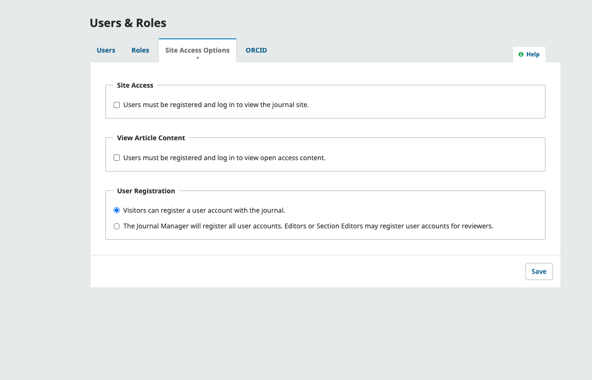
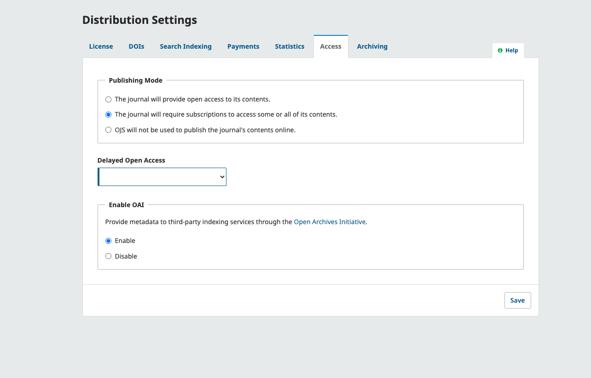
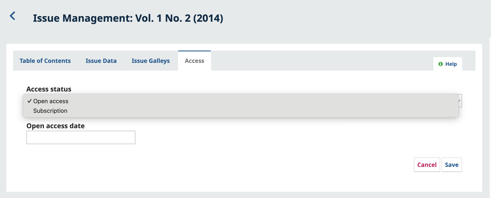
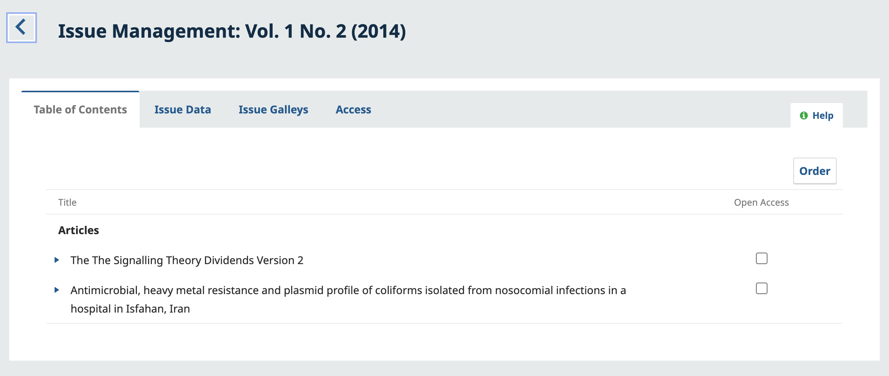

# Content Access: Who Can Read Your Journal’s Content? 

Next, you'll configure your site to decide who can access your journal and its content. You can determine if visitors need to register before they can access articles, as well as control what content is available for free or for subscription.

## Configure Site Access {#site-access}

The Site Access Options tab in the Users and Roles menu allows you to control who can register new accounts with the journal, as well as what parts of the site can be accessed without being logged into a user account.

This PKP School video explains how to configure site access options in OJS. To watch other videos in this series, visit [PKP’s YouTube channel](https://www.youtube.com/playlist?list=PLg358gdRUrDVTXpuGXiMgETgnIouWoWaY).



**Additional Site and Article Access Restrictions**: Choose from these options to limit visitors’ ability to view areas of the site without logging in.

> Keep in mind that while requiring registration to read open access content can be convenient for tracking readership, it can dissuade some people from reading your content. Use with care.
{:.tip}

**User Registration**: This option lets you decide if users can create their own accounts or if the only way to become a registered user is via invite.

## Configure Content Access and Distribution Settings {#content-access}

This section will guide you through configuring OJS to align with your content access model. OJS supports open access, subscriptions, embargos, and hybrid models, allowing you to precisely control access to published content.

### Content Access for Your Journal: Open Access, Subscription, or Hybrid? {#access-settings}

No matter what your publishing model, you’ll first need to visit the Access tab under Distribution Settings from the left sidebar.

This PKP School video explains how to configure the Access settings in OJS. To watch other videos in this series, visit [PKP’s YouTube channel](https://www.youtube.com/playlist?list=PLg358gdRUrDVTXpuGXiMgETgnIouWoWaY).



Here you will configure your journal content as open access, available by subscription, or a combination. By default, the open access option is selected. **If you wish to use OJS for a subscription journal**, choose the second option. 

This option also allows you to configure an embargo period under “Delayed Open Access”, which will delay open access to content by the selected period of time.

>If you are only using OJS to manage your submission workflow and not publish your content, you can simply select "OJS will not be used to publish the journal's contents online".
{:.tip}

**Enable OAI** will be enabled by default, as this is an important protocol used by many indexing services and other applications to harvest your journal's metadata. However, if you are not using OJS to publish your journal's content, you may wish to disable OAI. 

You can learn more about OAI and how it works with OJS by reading [Open Journal Theme’s How to setup OAI and check OAI on OJS? documentation](https://openjournaltheme.com/docs/how-to-setup-oai-and-check-oai-on-ojs/).

For journals adopting an Open Access model that does not require any payments or subscriptions,these are all the configurations you’ll need. If you plan on accepting payments and managing subscriptions in OJS, you’ll need to configure some additional settings described in the [Managing Payments and Subscriptions](URL) section.
### Content Access Settings at the Article or Issue Level {#article-issue-access}

OJS also allows you to configure how and when content can be accessed at an article and issue level. 

When you create an issue, there is a tab called **Access** under which you can set the **Access Status** as **Subscription** or **Open Access**.

If you set it as **Subscription**, underneath that a box will appear where you can optionally enter an **Open Access Date**, at which the content will become open access.

Once you set it as **Subscription**, on the **Table of Contents** tab, a checkbox will appear beside each article under **Open Access**, where you can optionally set individual articles as open access, even if the rest of the issue remains available by subscription.

### Manage Payments and Subscriptions {#payments-subscriptions}

For journals using subscriptions or charging fees, some additional configurations are needed.

If you plan on collecting payments such as APCs and offering subscriptions, all of the required settings are covered in our [Managing Subscriptions in OJS](URL) guide.
