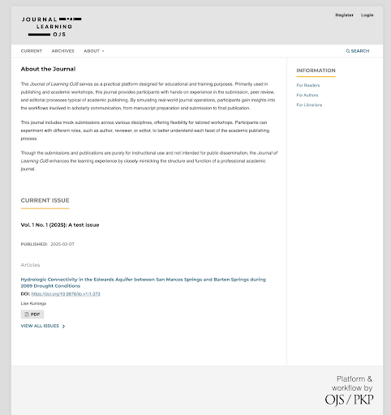
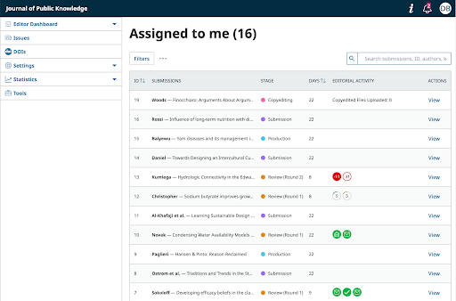
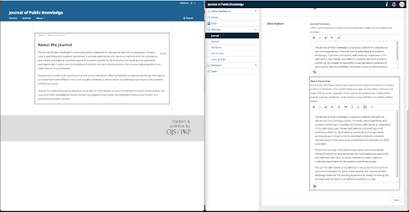
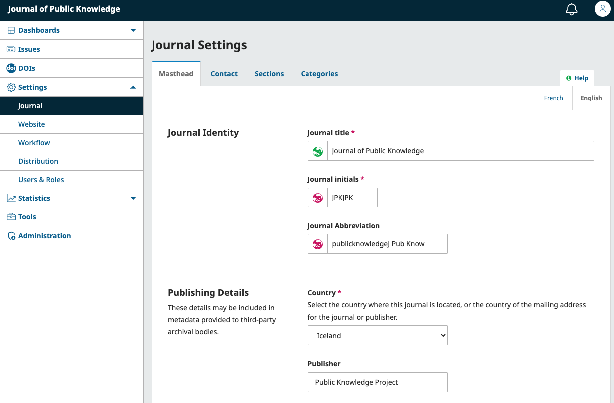
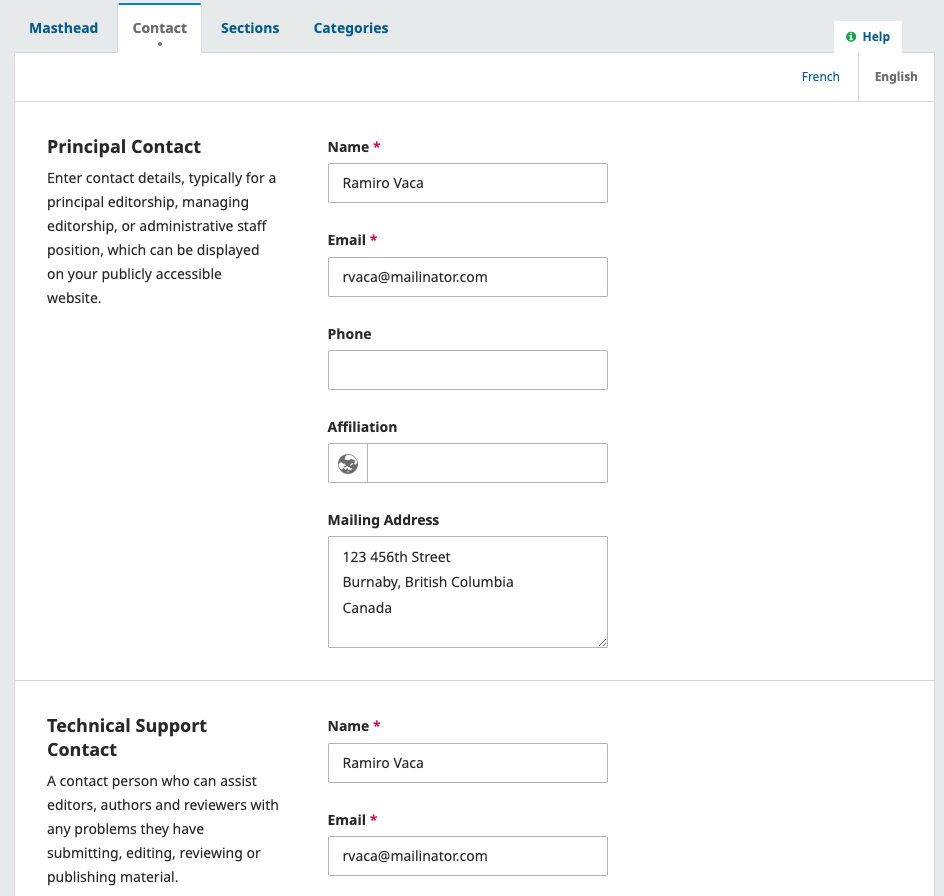

# Get Started: Plan & Enter Basic Journal Details
In this first chapter, you will ensure that you have everything you need ready to fully set up your journal in OJS before learning how to configure the basic information of your journal, such as the name, abbreviation, contact information, and masthead (editorial board information).

## What You’ll Need to Start {#start-checklist}
This guide assumes that you have already installed OJS and that your [Site Administrator](../../site-admin/en/) has finished the basic setup.

It also assumes that you’ve decided on the key details of your journal — such as who it’s for, what it publishes, and how it handles licensing. If you’re still working on those decisions, we recommend reading the [Short Guide to Starting a Journal](https://docs.pkp.sfu.ca/starting-a-journal/en/).

Before you begin, make sure you have the following information ready:

- The journal’s name and contact information  
- A description of the journal’s purpose, scope, and audience  
- A list of editorial board members  
- Submission guidelines and policies for authors  
- Peer review policies and guidelines  
- Your financial model (open access, hybrid, or subscription-based)  
- Copyright and licensing policies  
- An ISSN (or plan to get one after your first issue)  
- (Optional) DOI registration details, such as your prefix and agency (or plan to get these later)

This guide will show you how to set up your journal in OJS using the settings that match your policies and goals.

## Get to Know the Journal Manager User Interface {#ui-walkthrough}

The best way to understand how OJS works is to understand it as two parts: the Front End (the site that readers see, where your published content lives) and the Back End (your dashboard and workspace, the area where you manage the journal).

### The Front End (What Readers See)
The Reader-facing Front End area of your journal is visible to readers, authors, and visitors who are not logged in. This includes your journal homepage, navigation, article landing pages, and more.

The information and pages displayed here depend on the content you create and settings you make in the Back End as a Journal Manager.

### The Back End (Dashboard and Management)
The Back End is the area of the journal that you can only access after logging in. As a Journal Manager, your backend will have more functions than other roles in the journal. This includes the Settings menu, which you will use to set up your journal.

OJS will automatically create and display Front End pages and content depending on what is done in the Back End. For example, if you fill out the “About the Journal” section in the backend, that information will appear on the public “About” page.

When you update something in the Back End—like the journal’s title or theme, the creation of a new journal issue—it automatically updates on the Front End. 

As you move through the many Back End configuration steps in this guide, it can be helpful to check the Front End frequently to ensure you understand the impact your changes make. 

## Enter Basic Journal Information {#basic-info}
Journal Managers can enter basic information about their journal by selecting “Journal” under the Settings menu in the sidebar in the Back End.

Use the tabs to navigate to the different sections of Journal Settings: Masthead, Contact, Sections.

### Configure the Masthead {#masthead}
The first tab you’ll see after clicking “Journal” under the Setting menu is "Masthead". The Masthead tab is where you’ll enter the journal’s title, publisher details, ISSN, and other key information.

The first section, **Journal Identity**, is where you'll enter your preferred formats for your journal's name.

* **Journal title**: Enter the name of your journal, e.g. Journal of Software Documentation
* **Journal initials**: Enter the initials of the journal, e.g. JSD.
* **Journal Abbreviation**: Enter an optional preferred abbreviation of your journal name, e.g. JSoftDoc.

In the next section, **Publishing Details**, you'll enter additional details about your journal and its publisher.

* **Country**: Select the country where this journal is located, or the country of the mailing address for the journal or publisher.
* **Publisher**: Enter the name of the organization publishing the journal.
* **URL**: Optionally enter the URL for the site of the publishing organization.
* **Online ISSN**: Enter your journal's online ISSN.
* **Print ISSN**: Optionally, enter your journal's print ISSN.

An ISSN (International Standard Serial Number) is an eight-digit number which identifies journals. It is managed by a worldwide network of National Centres coordinated by an International Centre based in Paris, backed by Unesco and the French Government. A number can be obtained from the [ISSN web site](https://www.issn.org/). This can be done at any point in operating the journal.

> Note that the details entered here will be used by indexing and discovery services, but will not be displayed on your site. To show de tails such as the publisher name or ISSN on your site, you can enter it in "About the Journal" as described below. To display these details on every page, we recommend adding them to your site's footer. You can do this under [Website Settings > Appearance > Footer](./appearance.md#logo-sidebar).
{:.tip}

In the next section, **Editorial History**, you can enter additional information about the history of your Editorial Board. This will be linked under the automatically generated Editorial Board member list.

> A list of specific editorial board members, their roles, and term lengths will automatically be generated by OJS based on your settings. You'll learn how to configure and edit this list in the [Manage Users chapter](./users.md) of this guide.
{:.tip}

Lastly, in the **Description** section, you can freely enter any information you

**Journal Summary** is a brief description of your journal. If you are on an OJS installation with multiple journals, this text will appear with your journal listing. You can also choose to add the journal summary to the journal homepage in the Website Settings.

**About the Journal** is a space to add detailed information about your journal which may be of interest to readers, authors, or reviewers. This information will be prominently displayed in the **About the Journal** page accessible from your site's navigation.

This might include: your open access policy, the focus and scope of the journal, copyright notice, sponsorship disclosure, history of the journal, a privacy statement, and details about the journal’s inclusion in any archival system.

Hit the **Save** button to save your changes.

### Add Contact Information {#contact-info}
After clicking “Journal” under the Setting menu, you can navigate to the Contact tab to enter basic journal contact information.

This PKP School video explains how to add journal contact information in OJS. To watch other videos in this series, visit [PKP’s YouTube channel](https://www.youtube.com/playlist?list=PLg358gdRUrDVTXpuGXiMgETgnIouWoWaY).


Use this section to add relevant contacts for users who have questions about your journal.

**Principal Contact**: Add contact information for the journal's main contact person, including name, email, phone, affiliation, and mailing address for the journal. This will appear on the journal's Contact page.

**Technical Support Contact**: Add contact information for the journal's technical support person. This information will appear on the journal's Contact page and at different points in the submission workflow for users needing assistance.

Hit the **Save** button to save your changes.

Excellent work! Now you’ll move on to configuring settings and entering details related to receiving submissions, peer review, and copyright and licensing.
