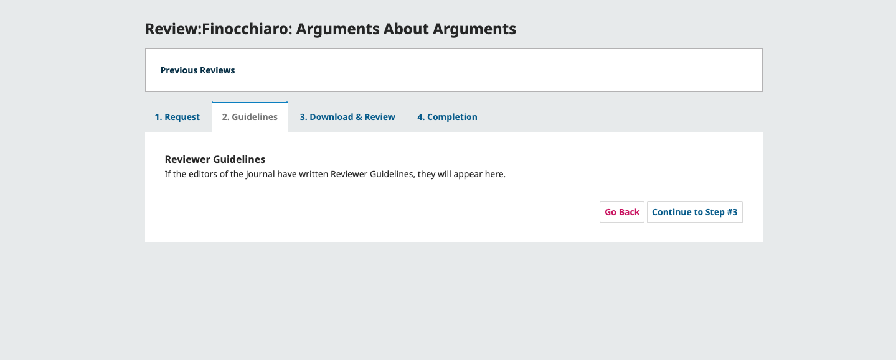
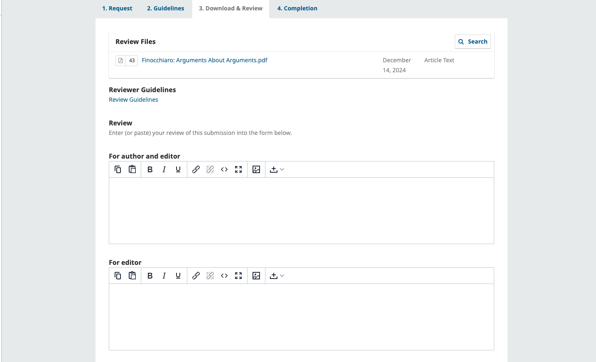
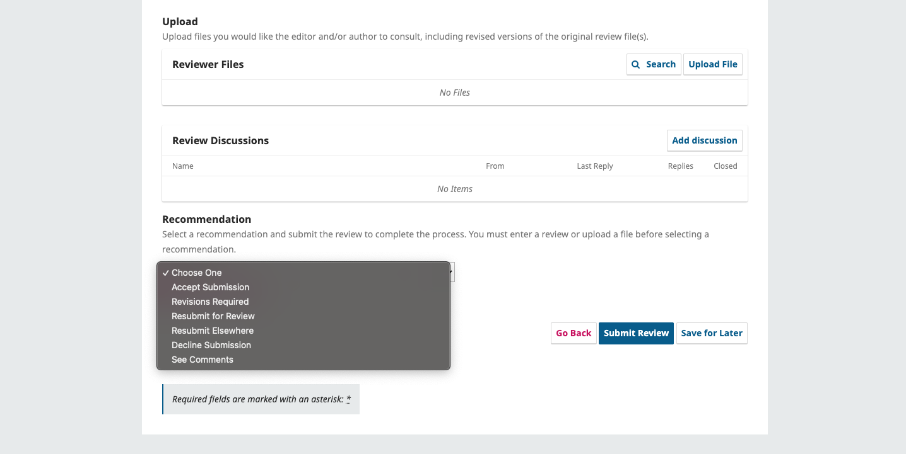
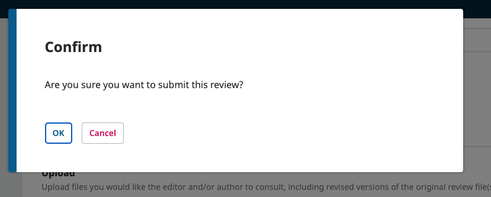
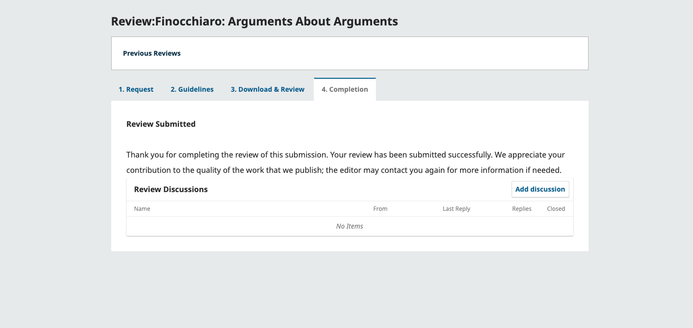

# Learning OJS for Reviewers
OJS allows Editors to invite users to participate in peer review. If you have been invited to conduct a review, this guide will teach you everything you need to successfully review a submission, including:
* Responding to a request to review a manuscript submission 
* Reading the journal’s guidelines for reviewers 
* Conducting a review 
* Completing a review

Other guides in this series include:
* [About OJS 3.5](../about-ojs/en/) - Learn the basics about OJS, including how to register and manage your account. Recommended as the starting point for all users.
* [Learning OJS 3.5 for Site Administrators](../site-admin/en/) - Learn how to manage an OJS installation and create new journals as a Site Administrator.
* [Learning OJS 3.5 for Journal Managers](../journal-manager/en/) - Learn how to configure and prepare a journal to publish from start to finish as a Journal Manager. 
* [Learning OJS 3.5: The Editorial Workflow](../editorial-workflow/en/) - Learn how to take a submission through review, copyediting, production, and publication. Recommended for Editors, Copyeditors, and Layout Designers.
* [Learning OJS 3.5 for Authors](../authors/en/) - Learn how to take a submission through review, copyediting, production, and publication. Recommended for Editors, Copyeditors, and Layout Designers.

## Respond to a Review Request {#respond-review-request}
Invitations to review will be sent to you by a journal editor or section editor. The invitation will be sent via email, with some basic information about the manuscript you’re being asked to review (title, abstract, and relevant dates), followed by a URL to respond to the request.

To respond to the review request, follow the link or log in to your account on the journal’s website. If you did not already have an account, the editor may have invited you to create a new one . 

After logging in, you will find the Review Assignment for this request in your Review Assignments Dashboard. If you do not see the submission you expect to see, please contact the journal editor.

On the top-right corner, the bell icon (notifications) shows your outstanding tasks. The review assignment will be included in your notifications.

From your queue on the Submissions Dashboard, click the Respond to request button to access your Review Assignment. You will see basic information about the article and the review assignment:
* **Article Title**: The title of the manuscript to be reviewed.
* **Abstract**: The abstract of the manuscript to be reviewed. 
* **Review Type**: The type of review you are being asked to conduct. 
* **Review Files**: All relevant files related to the manuscript.
* **Review Schedule**: The date the review request was sent, the due date for a response to the review request, and the due date for the review.
* **Review Type** is set by a journal’s editor. There are three types of review:
  * **Anonymous reviewer/Anonymous author**: a “double-blind” review in which neither the reviewer (you) nor the author know one another’s names.
  * **Anonymous reviewer/Disclosed author**: the name of the reviewer (you) is unknown to the author, but the name of the author is known to the reviewer.
  * **Open**: the name of the reviewer (you) will be known to the author when the review is submitted and the name of the author is known to the reviewer.
* **Review Schedule** is also set by the journal’s editor. Please note that none of the date fields in the review schedule are editable by the reviewer. These dates are only provided to help you assess whether you’re able to provide a review. If you’d like to negotiate new due dates, please contact the journal editor before accepting the review request.

Click “View all Submission Details” for additional information about the submission, including keywords. If the review type allows the author’s name to be disclosed, “View All Submission Details” will include the author’s name.

You will also be asked to agree to having your data collected and stored according to the journal’s privacy statement, which you can read before agreeing.
From here, you can decline or accept the review. If you decline, you will be dropped from the process. If you accept, you will move to review step 2.

To accept the assignment, click “Accept Review, Continue to Step #2”. To decline the assignment, click “Decline Review Request”.

## Read Review Guidelines {#read-review-guidelines}
If the editors of the journal have written Reviewer Guidelines, they will appear in the second step of the review process. Read these guidelines carefully before you begin your review.

You can review these guidelines at any time even after proceeding by clicking on the “2. Guidelines” tab.

Hit **Continue** to move to step 3.

## Conduct a Review {#conduct-review}
From here, you can download a copy of the review files and enter your review comments. The first window is for comments to the editor and the author; while any comments entered in the second window can only be seen by the editor.

If the journal’s editor has provided a Review Form, it will be visible in this step of the review process. Complete the form in accordance with the editor’s instructions.

Once you have read the paper and added your comments, you can optionally upload a marked up copy of the review file in the Upload section further down the page. 

> If the review type specifies an anonymous reviewer, remember to strip any personal identification from the file before uploading it. See [this page for details on anonymizing various documents](https://authorservices.taylorandfrancis.com/publishing-your-research/peer-review/anonymous-peer-review/).
{:.notice}

Next, you must then make your recommendation using the dropdown menu.

Possible choices include:
* **Accept Submission**:  The submission does not need further revisions or corrections. .
* **Revisions Required**: Requires minor changes.
* **Resubmit for Review**: Requires major changes and another round of peer review.
* **Resubmit Elsewhere**: Doesn’t fit the focus and scope of this journal.
* **Decline Submission**: Doesn’t fit the requirements of the journal and is unsuitable for publication.
* **See Comments**: If none of the above recommendations are suitable, you can leave a comment for the editor detailing your thoughts.

> Note: Some options may not available to you depending on the journal’s settings.
{:.tip}

## Use Discussions to Communicate With Editors {#review-discussion}
In both Step 3: Download & Review and Step 4: Completion, you will have access to the Review Discussion panel. You can use discussions to communicate with Editors if you have questions about the manuscript or the review process.

Click the “Add discussion” button to begin a new discussion. You can then choose which Editor(s) should receive the message, enter a subject and body, and optionally upload attachments.

Click a discussion in the panel to open it and view any replies, as well as add new messages.

## Complete a Review {#complete-review}

When you are satisfied with your review and your recommendation, hit the Submit Review button to complete your task. You’ll be asked to confirm.

Hit OK. You will be taken to the final confirmation screen thanking you for your work.

That's it! The review is now complete.

