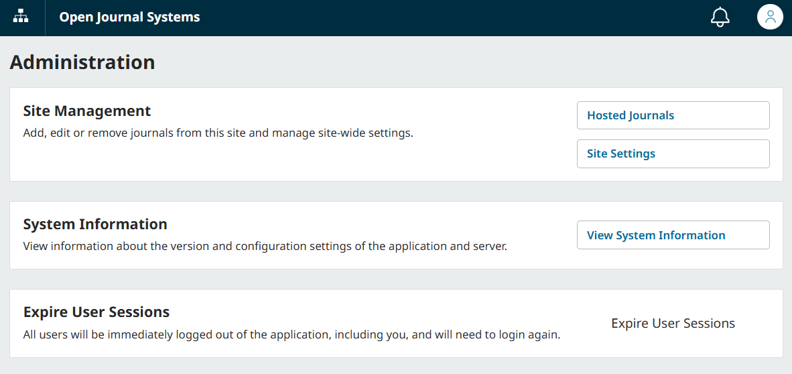
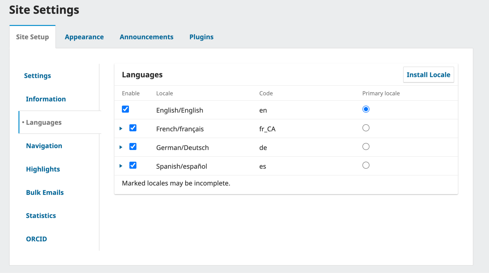
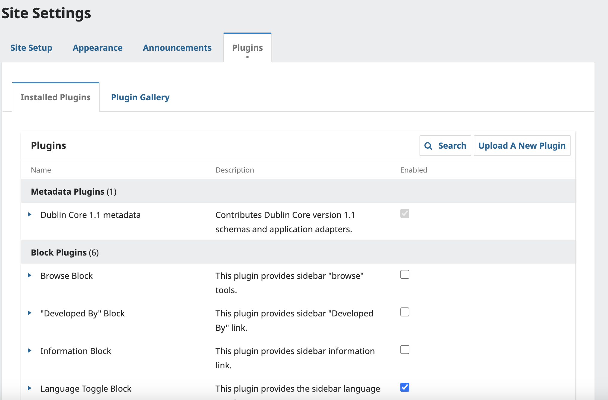
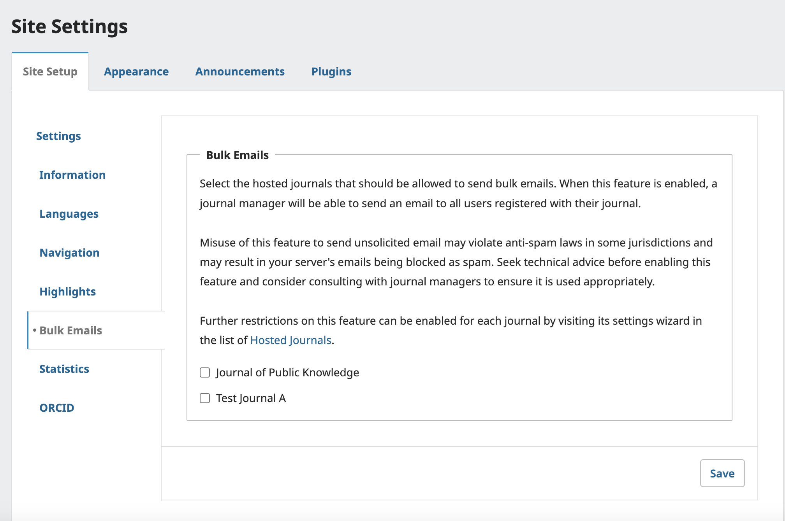
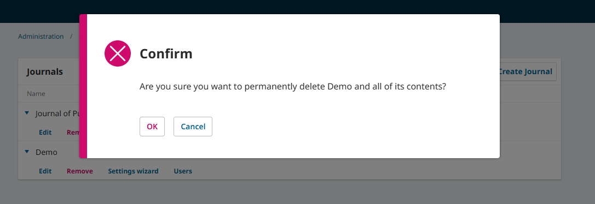
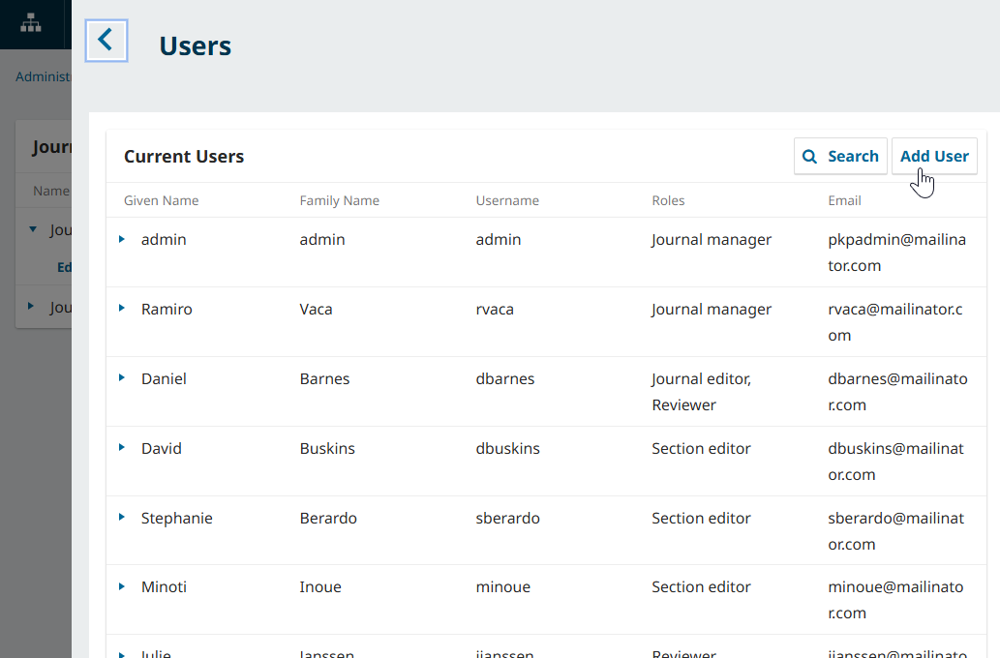
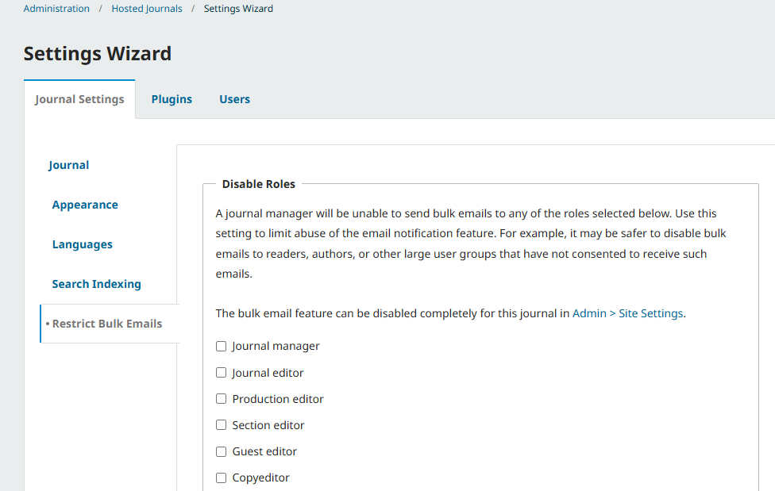
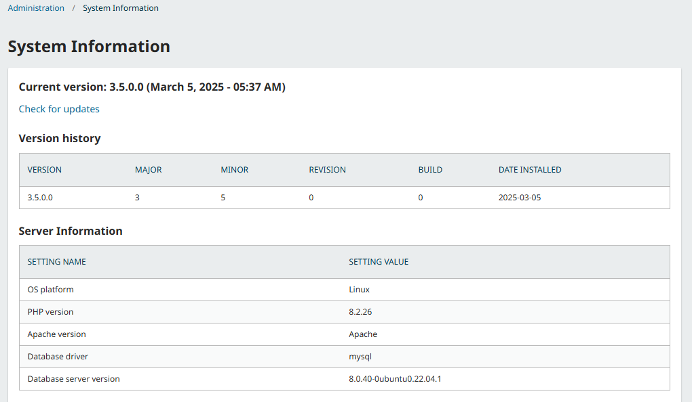

# Learning OJS for Site Administrators

The Site Administrator role in OJS is created as part of the OJS installation process performed by a system administrator. Tasks performed by this role include:
* Create, edit and delete journals from the installation
* Manage users and bulk email settings for each journal on the installation 
* Enable the languages and plugins available to journals on the installation
* Perform basic site maintenance tasks   

This guide covers the settings and functions in the Administration panel of your OJS installation. Technical information about administering an OJS site from the back end, including upgrades, email, statistics, and importing and exporting, please consult the [Administrator's Guide](https://docs.pkp.sfu.ca/admin-guide/en/).

Other guides in this series include:
* [About OJS 3.5](../../about-ojs/en/) - Learn the basics about OJS, including the new features added in 3.5. Recommended as the starting point for all users.
* [Learning OJS 3.5 for Journal Managers](../../journal-managers/en/) - Learn how to configure and prepare a journal to publish from start to finish as a Journal Manager. 
* [Learning OJS 3.5: The Editorial Workflow](../../editorial-workflow/en/) - Learn how to take a submission through review, copyediting, production, and publication. Recommended for Editors, Copyeditors, and Layout Designers.
* [Learning OJS 3.5 for Reviewers](../../reviewer/en/) - Learn how to respond to a review request and complete a review in OJS as a Reviewer.
* [Learning OJS 3.5 for Authors](../../author/en/) - Learn how to take a submission through review, copyediting, production, and publication. Recommended for Editors, Copyeditors, and Layout Designers.

## Access the Administration Menu {#admin-menu}
To access the Administration menu, login to a journal as the Site Administrator, and choose Administration from the left side menu. Alternatively, hover over your username while logged in and choose Administration.

## Configure OJS Site Settings {#sitewide-settings}

The “Site Settings” option will appear under “Site Management” in the Administration menu if you have two or more journals. This is where you can make configurations that apply to **your overall OJS installation**, particularly your main OJS site which contains a list of all hosted journals. This may not be relevant for those who only intend to host a single journal or those who do expect that readers will only access individual journal sites.

### Manage Languages {#languages}
OJS is designed to accommodate multilingualism, allowing journals supporting a wide variety of languages under a single site.
Although one or more locales (languages) can be installed when first configuring OJS, the Site Administrator can later configure the primary locale (default language) of the site and install new locales to make other languages available for use by journals under Administration > Site Settings > Site Setup > Languages. 

Here you can see all installed languages, enable, disable or remove languages, and set any language as the Primary Locale (the language that new users will see when first visiting the site).

To add an additional language:
1. Click Install Locale
2. Check off the locales you would like to install
3. Click Save

Once installed, Site Administrators and Journal Managers can further customize language settings on a per-journal basis. See the [Installing, Enabling, and Configuring Locales section of Using PKP Software in Multiple Languages](https://docs.pkp.sfu.ca/multiling-guide/en/locales) for details.

> Note: Not all locales are fully translated. For information on checking the completeness of a locale, please consult the [Planning section of Using PKP Software in Multiple Languages](https://docs.pkp.sfu.ca/multiling-guide/en/planning).

### Manage Plugins {#plugins}
From here, you can choose to enable or disable various plugins for all the journals on your OJS installation.

For detailed information about how to install, uninstall, update, and configure plugins, as well as a list of all available plugins, please see [the Plugin Guide Inventory](https://docs.pkp.sfu.ca/plugin-inventory/). Note that the Site Administrator is the only role permitted to install and uninstall plugins.

### Manage Appearance and Navigation Menus {#appearance}
Use the Appearance tab and the Navigation Menus subtab to customize the look of your main OJS site (i.e., the site that serves as an index for all hosted journals).

These options are functionally identical to the Appearance options for individual journals. Consult [the Customize the Look of Your Journal section of Learning OJS for Journal Managers](../../journal-managers/en/appearance) as well as the [Designing Your Journal guide](https://docs.pkp.sfu.ca/designing-your-journal/) for more information.

### Enable Bulk Emails {#bulk-emails}

Site Administrators can allow Journal Managers to send bulk emails to several user groups in a journal at one time. (See [Send Email Notifications to All Users with a Specific Role](../../journal-managers/en/communications#bulk-emails) for information on how this feature works once enabled). As the site administrator, you can use the Site Settings to select which hosted journals will be allowed to send bulk emails.

> Note: Misuse of this feature to send unsolicited email may violate anti-spam laws in some jurisdictions and may result in your server’s emails being blocked as spam. Seek technical advice before enabling this feature and consider consulting with journal managers to ensure it is used appropriately.
{:.warning}

It is possible to disable sending bulk emails to certain roles for individual journals by accessing the [Settings Wizard for that journal as described below](#per-journal-settings}.

## Create and Manage Hosted Journals {#hosted-journals}
Click “Hosted Journals” under “Site Management” to see the list of all journals in this OJS installation.

To edit an existing journal, click on the blue arrow to the left of the journal name. You will see options to edit, remove, or update the settings.

If you have multiple journals, you can use the **Order** button to change the order of the list. Drag and drop journals up and down the list, then click the Done button at the bottom of the list. Your changes will be reflected on the public list of journals.

The **Create Journal** button will let you add a new journal to this OJS installation. Fill out the necessary details in the window that appears to create a new journal.

> Note: If you do not want the new journal to be visible yet, uncheck the _Enable this journal to appear publicly on the site_ box.

Once you have saved your newly created journal, the Settings Wizard window will open.

**Edit** will let you change the journal details.

> If editing journal details, we strongly recommend not changing the path of a journal once it has published content.
{:.warning}

**Remove** will let you delete the journal from the installation. **Once you have confirmed that you wish to delete the journal and its contents, this action cannot be undone**.

**Settings Wizard** will take you to the settings for that journal. This option is described in depth below, under [Configure Journal-Specific Settings](#per-journal-settings).

**Users** will allow you to add and manage users associated with the journal. Once you have created a journal and completed your configurations, you will likely want to create a user account for the Journal Manager or Editor - see the [Users and Roles chapter](../../journal-managers/en/users) for details.

### Configure Journal-Specific Settings {#per-journal-settings}
Clicking **Settings Wizard** will take you to the settings for that journal. This can be used to adjust configurations at the individual journal level.

**Journal**: Functionally the same as the “Edit” button on the list of hosted journals. This can be used to change the descriptive information of a journal.
**Appearance**: Customize the theme and appearance of the journal. See our [Designing Your Journal Guide](https://docs.pkp.sfu.ca/designing-your-journal/) for detailed information.
**Language**: Enable different languages for various areas of the site (i.e. UI, forms, submissions). Consult the [Installing, Enabling, and Configuring Locales section of Using PKP Software in Multiple Languages](https://docs.pkp.sfu.ca/multiling-guide/) to learn more.
**Search Indexing**: Allows you to set up search engine optimization. See the [Set up Search Engine Optimization section of Learning OJS for Journal Managers](../../journal-managers/en/archive-seo#seo) to learn more

The setting options above are identical to those accessible to Journal Managers; however, there is one setting in this panel only available to Site Administrators: the Restrict Bulk Emails by Role tab.

#### Restrict Bulk Emails by Role {#restrict-bulk}
The Restrict Bulk Emails tab in the Settings Wizard allows you to disallow sending of bulk emails to specific roles. Journal managers and editors will be unable to send bulk emails to any roles that you select under “Disable Roles”.

>In order to access these options, the bulk email feature must first be enabled under [Site Settings > Bulk Emails](#bulk-emails). 

Use this to limit potential abuse of the email notification feature. For example, it may be preferable to disable bulk emails to readers, authors, or other large user groups that have not consented to receive such emails.

## Perform Site Maintenance Tasks {#maintenance-tasks}
In addition to the ability to manage hosted journals and site-wide settings, the Administration menu offers other administrative functions related to basic site maintenance including viewing system information, expiring user sessions, and clearing caches and logs.

### View System Information {#sys-info}
The “View System Information” link in the Administration menu will allow you to view the details of your installation.

OJS Version information shows which version is currently installed, as well as a version history including any upgrades. You can click the “Check for updates” link to see if you are using the most recent version of OJS.

The Server Information section provides details about the server environment hosting your OJS installation.
The OJS Configuration section displays all of the configuration options and their values as they have been entered in _config.inc.php_.

> Detailed information about _config.inc.php_ configuration parameters can be found in the file itself, and in the [System Administrator Guide](https://docs.pkp.sfu.ca/admin-guide/en/deploy#configuration).
{:.tip}

The final section on this page displays additional server information: your operating system, PHP version, server and database information. You can also view extended PHP information by clicking the Extended PHP information link (this displays the output of `phpinfo()`).
This information is highly useful when trying to troubleshoot a problem or report an issue.

### Expire User Sessions {#user-sessions}
Clicking _Expire User Sessions_ in the Administration menu will immediately clear all active user sessions in the system, requiring any user that is currently logged in to sign in to the system again. This can be useful before an upgrade, to ensure all users are logged out.

### Clear Data Caches {#data-cache}
Clicking _Clear Data Caches_ in the Administration menu will clear all cached data, including locale information, help cache, and search cache. This function may be useful to force data to be reloaded after customizations have been made.

### Clear Template Cache {#template-cache}
Clicking _Clear Template Cache_ in the Administration menu will clear all cached versions of HTML templates. This function may be useful to force templates to be reloaded after making customizations.

### Clear Scheduled Task Execution Logs {#task-logs}
If scheduled tasks have been enabled for your journal, clicking _Clear Scheduled Task Execution Logs_ in the Administration menu will delete the task execution log files from your server. The execution log files include dates that correspond to previously completed scheduled tasks (e.g. sending automatic email review reminders).
