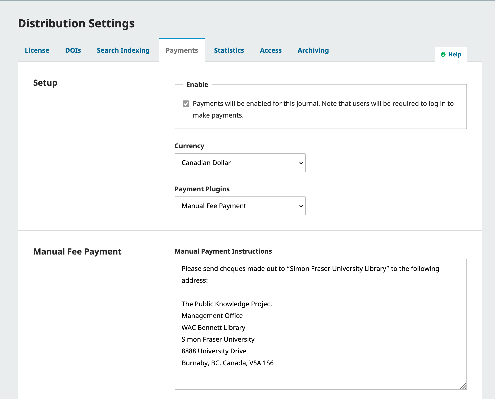

To access the Payments menu and make configurations for subscriptions or other fees, you’ll first need to enable payments and choose a payment type. OJS allows you to accept payments through PayPal using the PayPal plugin, or manual payments (such as cheque, email transfer, etc.- however, these will need to be manually tracked in the system). **No other payment methods are currently available for OJS.** 

This PKP School video explains how to configure the Payments settings in OJS. To watch other videos in this series, visit [PKP’s YouTube channel](https://www.youtube.com/playlist?list=PLg358gdRUrDVTXpuGXiMgETgnIouWoWaY).



To start receiving payments and using subscriptions in OJS, first, you need to enable and configure the payment settings.
Go to Settings - Distribution > Payments.
Select the checkbox to Enable Payments. 
Choose the currency you will use.
Under Payment Plugins, select your fee payment method. You can choose either [Manual Fee Payment](#manual-payment) or [PayPal Fee Payment](#paypal-payment). To complete the setup for your selected payment method, follow the instructions in the relevant section below. 
Click Save.

>Please note that OJS 3.x does not offer any means to accept or manage donations at this time. 
{:.tip}

After saving, a new menu item called Payments will appear on the main dashboard menu (left panel). This is where you can manage subscriptions and payments in detail.

### Set Up Manual Payments {#manual-payments

If you selected **Manual Fee Payment** under Payment Plugins, enter the instructions into the Manual Fee Payment box and click the Save button. 

What you enter will depend on the types of payments you want to accept, but it might look like instructions for sending a cheque or using an external payment service.

You can now proceed to the next section to learn how to [manage subscriptions](#manage-subscriptions) or [configure fees](#set-fees).

### Configure the Paypal Payment Plugin {#paypal-plugin}

If you select the **PayPal Fee Payment** method in the Payment Plugins, follow these instructions to complete configuration:
You will need to register for a Paypal Business Account with PayPal. Consult [PayPal’s documentation](https://www.paypal.com/ca/business/open-business-account) for more information.

Next, obtain the API credentials needed to connect PayPal with OJS. To learn how to obtain a client ID and secret as a merchant, we recommend [following this guide from Upwork](https://www.upwork.com/resources/paypal-client-id-secret-key). 

Return to Settings - Distribution > Payments in OJS. In the PayPal Fee Payment section, enter your PayPal Account Name, Client ID, and Secret. Click Save.

#### Test and Troubleshoot PayPal Integration {#paypal-test}

If you wish to test your Paypal integration, follow [PayPal’s Sandbox Testing Guide](https://developer.paypal.com/tools/sandbox/) to create a Developer Account, sandbox API credentials and test accounts to simulate paying fees. 

To begin testing, **replace the details in Settings - Distribution > Payments: PayPal Fee Payment with your sandbox credentials, and enable Test Mode**. You can then simulate purchasing a subscription or paying fees with your PayPal sandbox accounts.

If your test transactions are not successful, please double-check the following:
* The credentials in Settings - Distribution > Payments: PayPal Fee Payment are correctly entered.
* The credentials entered are the sandbox API credentials.
* Test mode is enabled in OJS.

> Remember to switch back to your real account’s API credentials and disable test mode when you are done testing.
{:.warning}